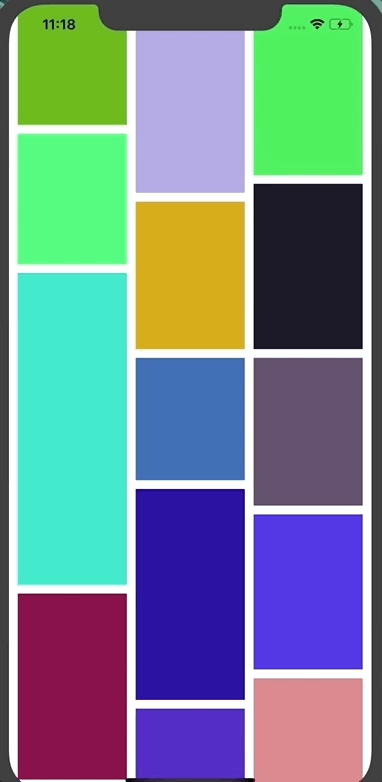

# LJJWaterFlowLayout
注释得非常清楚的瀑布流实现和想法




准备布局item前调用，可以在这里面完成必要属性的初始化
```
- (void)prepareLayout {
    [super prepareLayout];
    //初始化间距
    self.minimumInteritemSpacing = kInterItemSpacing;
    self.minimumLineSpacing = kLineSpacing;
    //初始化存储容器
    _attributes = [NSMutableDictionary dictionary];
    _cloArray = [NSMutableArray arrayWithCapacity:kColumnCount];
    for (int i=0; i<kColumnCount; ++i) {
        [_cloArray addObject:@(0.f)];
    }
    self.delegate = (id<UICollectionViewDelegateFlowLayout>)self.collectionView.delegate;
    //遍历所有item获取位置信息并且储存

    NSUInteger sectionCount = [self.collectionView numberOfSections];
    for (int section=0; section<sectionCount; ++section) {
        NSUInteger itemCount = [self.collectionView numberOfItemsInSection:section];
        for (int row=0; row<itemCount; ++row) {
            [self layoutEachItemFrameAtIndexPath:[NSIndexPath indexPathForRow:row inSection:section]];
            }
    }
}
```
设置每个item的尺寸并和indexPath为键值对存在字典里

```
- (void)layoutEachItemFrameAtIndexPath:(NSIndexPath *)indexPath {
    //代理获取itemSize
    UIEdgeInsets edgeInsets = [self.delegate collectionView:self.collectionView layout:self insetForSectionAtIndex:indexPath.section];
    CGSize itemSize = [self.delegate collectionView:self.collectionView layout:self sizeForItemAtIndexPath:indexPath];
    NSLog(@"前大小:%@",NSStringFromCGSize(itemSize));

    CGFloat itemWidth = (kScreenWidth - (kColumnCount - 1)*kInterItemSpacing-edgeInsets.left-edgeInsets.right) / 3;

    CGFloat itemHeight = itemWidth*itemSize.height/itemSize.width;
    //得到等比例大小
    itemSize = CGSizeMake(itemWidth, itemHeight);
    NSLog(@"得到等比例大小:%@",NSStringFromCGSize(itemSize));
    //获取列数中高度最低的一组
    NSUInteger miniClo = 0;
    CGFloat miniHeight = [_cloArray[miniClo] floatValue];
    for (int clo=1; clo<_cloArray.count; ++clo) {
        CGFloat currentCloHeight = [_cloArray[clo] floatValue];
    //如果当前列的高度小于最低y高度，则重新赋值
        if (miniHeight > currentCloHeight) {
            miniHeight = currentCloHeight;
            miniClo = clo;
        }
    }

    //找到高度最小的列为clo,最小高度为miniClo
    //在当前高度最低的列上面追加item并且存储位置信息
    CGFloat x = edgeInsets.left + miniClo*(kInterItemSpacing+itemWidth);
    CGFloat y = edgeInsets.top + miniHeight;
    //确定cell的frame
    CGRect frame = CGRectMake(x, y, itemSize.width, itemSize.height);
    //每个cell的frame对应一个indexPath，放入字典中
    [_attributes setValue:indexPath forKey:NSStringFromCGRect(frame)];
    //更新列高
    [_cloArray replaceObjectAtIndex:miniClo withObject:@(CGRectGetMaxY(frame))];
}
```


